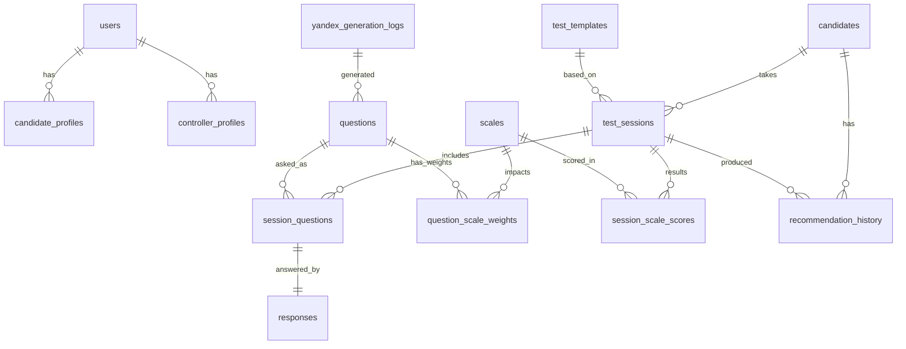

# Проектирование системы адаптивного психологического тестирования кандидатов

## 1. Общее описание

Система предназначена для предварительного подбора кандидатов на позиции операторов автоматизированных технических систем. Приложение реализуется в формате **client-server**:
- **Android-клиент** (Kotlin, Jetpack Compose, MVVM) для прохождения теста и просмотра результатов;
- **Backend API** (рекомендуется Kotlin Spring Boot) для бизнес-логики адаптации, хранения данных, авторизации и интеграции с Yandex GPT;
- **PostgreSQL** для хранения кандидатов, сессий тестирования, шкал, ответов и истории;
- **Yandex GPT** как внешний сервис генерации/вариативности вопросов (через backend, без прямого доступа клиента).

Стартовая версия оценивает 5 шкал:
1. Концентрация внимания
2. Стрессоустойчивость
3. Ответственность
4. Адаптивность
5. Скорость и точность принятия решений

Результат теста отображается в виде **radar/pentagon chart**, где каждая грань — отдельная шкала (0..100).
Тестирование носит **рекомендательный** характер и не является единственным основанием для кадровых решений.

---

## 2. Архитектура

### 2.1 Логическая архитектура

**Клиентский слой (Android):**
- UI (Compose)
- Presentation (ViewModel)
- Domain (use-cases)
- Data (repository, API client, local cache)

**Серверный слой (Backend):**
- API Gateway / REST Controllers
- Auth module (JWT)
- Test Session Orchestrator
- Adaptive Engine
- Question Generator Adapter (Yandex GPT)
- Scoring Engine
- Reporting module
- Audit/Logging

**Инфраструктурный слой:**
- PostgreSQL
- Redis (опционально, кэш вопросов/сессий)
- Object storage (опционально, экспорты отчетов)
- Monitoring (Prometheus/Grafana), centralized logs

### 2.2 Компонентная схема взаимодействия

1. Candidate авторизуется в Android.
2. Клиент запрашивает `start test session`.
3. Backend инициализирует профиль сессии (начальные оценки по шкалам = 50/100, uncertainty высокая).
4. Backend Adaptive Engine определяет следующую целевую шкалу.
5. Backend запрашивает вопрос:
   - сначала из локального банка шаблонов;
   - при необходимости вариативности — через Yandex GPT Adapter.
6. Клиент получает вопрос и отправляет ответ.
7. Backend пересчитывает оценки по шкалам, uncertainty и критерии остановки.
8. По завершении backend сохраняет итоговый профиль и историю, возвращает радар-результат.
9. Controller просматривает результаты одного/нескольких кандидатов (агрегированные и детальные).

### 2.3 Расширяемость по числу шкал

Ключевой принцип: шкалы — это данные, а не захардкоженная логика.
- Таблица `scales` + `test_template_scales`;
- весовые коэффициенты вопросов по шкалам хранятся в БД;
- рендер radar chart строится динамически по списку шкал.

---

## 3. Модель данных

### 3.1 ER-диаграмма (текстовая)



### 3.2 PostgreSQL структура (DDL-скелет)

```sql
CREATE TABLE roles (
  id BIGSERIAL PRIMARY KEY,
  code VARCHAR(32) UNIQUE NOT NULL -- CANDIDATE, CONTROLLER, ADMIN
);

CREATE TABLE users (
  id BIGSERIAL PRIMARY KEY,
  email VARCHAR(255) UNIQUE NOT NULL,
  password_hash TEXT NOT NULL,
  role_id BIGINT NOT NULL REFERENCES roles(id),
  is_active BOOLEAN NOT NULL DEFAULT TRUE,
  created_at TIMESTAMPTZ NOT NULL DEFAULT now()
);

CREATE TABLE candidates (
  id BIGSERIAL PRIMARY KEY,
  user_id BIGINT UNIQUE NOT NULL REFERENCES users(id),
  full_name VARCHAR(255) NOT NULL,
  birth_date DATE,
  external_ref VARCHAR(128),
  created_at TIMESTAMPTZ NOT NULL DEFAULT now()
);

CREATE TABLE controllers (
  id BIGSERIAL PRIMARY KEY,
  user_id BIGINT UNIQUE NOT NULL REFERENCES users(id),
  full_name VARCHAR(255) NOT NULL,
  department VARCHAR(255),
  created_at TIMESTAMPTZ NOT NULL DEFAULT now()
);

CREATE TABLE scales (
  id BIGSERIAL PRIMARY KEY,
  code VARCHAR(64) UNIQUE NOT NULL,
  name VARCHAR(255) NOT NULL,
  description TEXT,
  min_value NUMERIC(5,2) NOT NULL DEFAULT 0,
  max_value NUMERIC(5,2) NOT NULL DEFAULT 100,
  is_active BOOLEAN NOT NULL DEFAULT TRUE
);

CREATE TABLE test_templates (
  id BIGSERIAL PRIMARY KEY,
  code VARCHAR(64) UNIQUE NOT NULL,
  name VARCHAR(255) NOT NULL,
  version INTEGER NOT NULL,
  is_active BOOLEAN NOT NULL DEFAULT TRUE,
  created_at TIMESTAMPTZ NOT NULL DEFAULT now()
);

CREATE TABLE test_template_scales (
  id BIGSERIAL PRIMARY KEY,
  template_id BIGINT NOT NULL REFERENCES test_templates(id),
  scale_id BIGINT NOT NULL REFERENCES scales(id),
  weight NUMERIC(6,4) NOT NULL DEFAULT 1,
  UNIQUE(template_id, scale_id)
);

CREATE TABLE questions (
  id BIGSERIAL PRIMARY KEY,
  source VARCHAR(32) NOT NULL, -- STATIC | YANDEX_GPT | FALLBACK
  text TEXT NOT NULL,
  question_type VARCHAR(32) NOT NULL, -- LIKERT_5 | SJT | MULTI_CHOICE
  difficulty NUMERIC(5,2) NOT NULL,
  quality_score NUMERIC(5,2),
  metadata_json JSONB,
  is_active BOOLEAN NOT NULL DEFAULT TRUE,
  created_at TIMESTAMPTZ NOT NULL DEFAULT now()
);

CREATE TABLE question_options (
  id BIGSERIAL PRIMARY KEY,
  question_id BIGINT NOT NULL REFERENCES questions(id) ON DELETE CASCADE,
  option_code VARCHAR(64) NOT NULL,
  option_text TEXT NOT NULL,
  option_order INTEGER NOT NULL,
  score_vector_json JSONB NOT NULL
);

CREATE TABLE question_scale_weights (
  id BIGSERIAL PRIMARY KEY,
  question_id BIGINT NOT NULL REFERENCES questions(id) ON DELETE CASCADE,
  scale_id BIGINT NOT NULL REFERENCES scales(id),
  weight NUMERIC(6,4) NOT NULL,
  direction SMALLINT NOT NULL DEFAULT 1,
  UNIQUE(question_id, scale_id)
);

CREATE TABLE test_sessions (
  id BIGSERIAL PRIMARY KEY,
  candidate_id BIGINT NOT NULL REFERENCES candidates(id),
  template_id BIGINT NOT NULL REFERENCES test_templates(id),
  status VARCHAR(32) NOT NULL, -- CREATED | IN_PROGRESS | FINISHED | ABORTED
  started_at TIMESTAMPTZ,
  finished_at TIMESTAMPTZ,
  adaptive_state_json JSONB,
  recommendation_text TEXT,
  created_at TIMESTAMPTZ NOT NULL DEFAULT now()
);

CREATE TABLE session_questions (
  id BIGSERIAL PRIMARY KEY,
  session_id BIGINT NOT NULL REFERENCES test_sessions(id) ON DELETE CASCADE,
  question_id BIGINT NOT NULL REFERENCES questions(id),
  order_no INTEGER NOT NULL,
  generated_by VARCHAR(32) NOT NULL, -- RULE | GPT | FALLBACK
  asked_at TIMESTAMPTZ NOT NULL DEFAULT now(),
  UNIQUE(session_id, order_no)
);

CREATE TABLE responses (
  id BIGSERIAL PRIMARY KEY,
  session_question_id BIGINT UNIQUE NOT NULL REFERENCES session_questions(id) ON DELETE CASCADE,
  selected_option_id BIGINT REFERENCES question_options(id),
  free_text_answer TEXT,
  response_time_ms INTEGER,
  confidence_level SMALLINT,
  created_at TIMESTAMPTZ NOT NULL DEFAULT now()
);

CREATE TABLE session_scale_scores (
  id BIGSERIAL PRIMARY KEY,
  session_id BIGINT NOT NULL REFERENCES test_sessions(id) ON DELETE CASCADE,
  scale_id BIGINT NOT NULL REFERENCES scales(id),
  raw_score NUMERIC(7,3) NOT NULL,
  normalized_score NUMERIC(7,3) NOT NULL,
  uncertainty NUMERIC(7,3),
  percentile NUMERIC(7,3),
  UNIQUE(session_id, scale_id)
);

CREATE TABLE recommendation_history (
  id BIGSERIAL PRIMARY KEY,
  candidate_id BIGINT NOT NULL REFERENCES candidates(id),
  session_id BIGINT NOT NULL REFERENCES test_sessions(id),
  recommendation_level VARCHAR(32) NOT NULL, -- LOW | MEDIUM | HIGH
  recommendation_text TEXT NOT NULL,
  created_at TIMESTAMPTZ NOT NULL DEFAULT now()
);

CREATE TABLE yandex_generation_logs (
  id BIGSERIAL PRIMARY KEY,
  request_payload JSONB NOT NULL,
  response_payload JSONB,
  status VARCHAR(32) NOT NULL, -- SUCCESS | TIMEOUT | ERROR
  error_message TEXT,
  latency_ms INTEGER,
  created_at TIMESTAMPTZ NOT NULL DEFAULT now()
);
```

---

## 4. API

### 4.1 Auth
- `POST /api/v1/auth/login` → JWT access + refresh
- `POST /api/v1/auth/refresh`
- `POST /api/v1/auth/logout`

### 4.2 Candidate
- `POST /api/v1/candidate/sessions` — старт новой сессии
- `GET /api/v1/candidate/sessions/{sessionId}/next-question`
- `POST /api/v1/candidate/sessions/{sessionId}/answers`
- `POST /api/v1/candidate/sessions/{sessionId}/finish`
- `GET /api/v1/candidate/sessions/{sessionId}/result` — pentagon + интерпретация
- `GET /api/v1/candidate/sessions/history`

### 4.3 Controller
- `GET /api/v1/controller/candidates?query=&page=`
- `GET /api/v1/controller/candidates/{candidateId}/sessions`
- `GET /api/v1/controller/sessions/{sessionId}/result`
- `GET /api/v1/controller/reports/summary?from=&to=&department=`

### 4.4 Пример ответа результата

```json
{
  "sessionId": 10245,
  "candidateId": 778,
  "finishedAt": "2026-03-13T10:22:12Z",
  "scales": [
    {"code": "attention", "name": "Концентрация внимания", "score": 74.2, "uncertainty": 6.1},
    {"code": "stress", "name": "Стрессоустойчивость", "score": 61.5, "uncertainty": 8.3},
    {"code": "responsibility", "name": "Ответственность", "score": 82.7, "uncertainty": 4.8},
    {"code": "adaptability", "name": "Адаптивность", "score": 69.9, "uncertainty": 6.9},
    {"code": "decision_speed_accuracy", "name": "Скорость и точность решений", "score": 58.4, "uncertainty": 9.7}
  ],
  "recommendation": {
    "level": "MEDIUM",
    "text": "Рекомендован при условии дополнительного обучения и повторной оценки через 3 месяца."
  },
  "chart": {
    "type": "radar",
    "min": 0,
    "max": 100
  }
}
```

---

## 5. Алгоритм адаптивного тестирования

### 5.1 Идея

Используется гибрид:
- правила контент-баланса по шкалам;
- байесовское обновление оценки шкалы (score + uncertainty);
- выбор следующего вопроса по максимальной ожидаемой информативности.

### 5.2 Псевдокод

```text
init_session(candidate_id, template_id):
    state.scores[scale] = 50
    state.uncertainty[scale] = 25
    state.asked_questions = {}
    state.min_questions = 20
    state.max_questions = 45
    state.target_uncertainty = 7

while not stop_condition(state):
    target_scale = argmax(state.uncertainty with balance_penalty)

    candidates = select_questions(
        scale=target_scale,
        difficulty~state.scores[target_scale],
        exclude=state.asked_questions,
        limit=20
    )

    if len(candidates) < threshold:
        generated = yandex_gpt_generate_question(target_scale, state)
        if validate(generated):
            q = persist_question(generated, source="YANDEX_GPT")
        else:
            q = fallback_from_static_bank(target_scale)
    else:
        q = best_information_gain(candidates, state)

    ask(q)
    answer = receive_answer()
    state.asked_questions.add(q.id)

    state = update_scores_bayesian(state, q, answer)
    state = apply_consistency_checks(state, q, answer)

final_scores = normalize(state.scores)
recommendation = derive_recommendation(final_scores, policy_rules)
save_session(final_scores, recommendation, history)
return result
```

### 5.3 Критерии остановки
- достигнуто `min_questions` и uncertainty по всем шкалам ниже порога;
- достигнуто `max_questions`;
- истек лимит времени сессии;
- кандидат завершил досрочно (статус ABORTED).

### 5.4 Fallback при недоступности Yandex GPT
1. Retry: 2–3 попытки с exponential backoff (например, 0.5s, 1s, 2s).
2. Circuit breaker на 1–5 минут при серии ошибок.
3. Переключение на локальный банк вопросов (`source=FALLBACK`).
4. Деградация режима: отключить генерацию новых формулировок, использовать только валидационные шаблоны.
5. Логирование инцидента в `yandex_generation_logs` + алертинг.

---

## 6. Android-клиент

### 6.1 Модули приложения

- `app` (entrypoint, navigation)
- `core-ui` (тема, компоненты, chart-виджеты)
- `core-network` (Ktor/Retrofit, interceptors, JWT handling)
- `feature-auth` (login/refresh/logout)
- `feature-candidate-test` (сессия теста, ответы, таймер)
- `feature-candidate-results` (radar chart, история)
- `feature-controller-dashboard` (поиск кандидатов, списки, фильтры)
- `feature-controller-details` (карточка кандидата, динамика по сессиям)
- `core-storage` (DataStore для токенов/настроек)

### 6.2 MVVM + Compose

- `ViewModel` управляет состоянием экранов;
- `StateFlow`/`UiState` для реактивного UI;
- `Repository` скрывает источники данных (API/cache);
- `UseCase` инкапсулирует бизнес-операции клиента.

### 6.3 Графика результата (radar/pentagon)

- Динамическое построение осей по `scales[]` из ответа API;
- Нормирование диапазона 0..100;
- Отображение uncertainty (полупрозрачная область/ошибки);
- Сравнение последней сессии с предыдущей (второй контур).

---

## 7. Backend

### 7.1 Предпочтительный стек

**Kotlin + Spring Boot**
- Spring Web, Spring Security, Spring Data JPA
- Flyway для миграций
- PostgreSQL driver
- Redis (опционально)
- OpenAPI/Swagger

(Альтернатива: FastAPI + SQLAlchemy + Alembic + Pydantic)

### 7.2 Модули backend

- `auth-service`: JWT, refresh-токены, ролевые политики
- `user-service`: профили кандидатов/контролёров
- `test-session-service`: lifecycle сессий
- `adaptive-engine-service`: выбор следующего вопроса и обновление score
- `question-bank-service`: локальный банк вопросов, версионирование
- `yandex-gpt-adapter`: интеграция, валидация, fallback
- `scoring-service`: расчет итогов, percentiles, confidence
- `reporting-service`: выборки для controller
- `audit-service`: события доступа/изменений

### 7.3 Интеграция с Yandex GPT (формат)

#### Запрос (backend -> Yandex GPT)

```json
{
  "modelUri": "gpt://<folder_id>/yandexgpt-lite",
  "completionOptions": {
    "stream": false,
    "temperature": 0.3,
    "maxTokens": 600
  },
  "messages": [
    {
      "role": "system",
      "text": "Ты генерируешь валидные психологические вопросы для операторов АТС, строго в JSON без лишнего текста."
    },
    {
      "role": "user",
      "text": "Сгенерируй 1 вопрос для шкалы 'стрессоустойчивость' сложности 0.65. Верни JSON по схеме..."
    }
  ]
}
```

#### Целевой JSON-ответ от GPT (внутренний контракт)

```json
{
  "question": {
    "text": "Во время аварийной ситуации ... ваши действия?",
    "type": "SJT",
    "difficulty": 0.65,
    "scale_weights": [
      {"scale_code": "stress", "weight": 0.70, "direction": 1},
      {"scale_code": "decision_speed_accuracy", "weight": 0.30, "direction": 1}
    ],
    "options": [
      {
        "code": "A",
        "text": "Сначала стабилизирую систему по регламенту",
        "score_vector": {
          "stress": 0.8,
          "decision_speed_accuracy": 0.7,
          "responsibility": 0.6
        }
      },
      {
        "code": "B",
        "text": "Жду указаний руководителя",
        "score_vector": {
          "stress": 0.4,
          "decision_speed_accuracy": 0.3,
          "responsibility": 0.5
        }
      }
    ],
    "quality_flags": {
      "no_bias": true,
      "clear_language": true,
      "domain_relevant": true
    }
  }
}
```

#### Валидация ответа GPT на backend
- JSON schema validation;
- ограничение длины текста;
- проверка наличия всех обязательных шкал из шаблона;
- антидубликат (semantic + lexical similarity);
- модерация (запрещенный/дискриминационный контент).

---

## 8. Безопасность

- JWT access (короткий TTL) + refresh token (ротация);
- RBAC:
  - `CANDIDATE`: только собственные сессии/результаты;
  - `CONTROLLER`: доступ только к назначенным кандидатам/подразделениям;
  - `ADMIN`: управление шаблонами/шкалами.
- TLS везде;
- пароль: Argon2/Bcrypt;
- шифрование чувствительных полей (при необходимости);
- аудит действий контролёра (кто и чьи результаты просматривал);
- rate limit на auth и генерацию вопросов;
- защита от подмены sessionId (проверка владения ресурсом);
- минимизация PII в логах;
- хранение истории прохождений с неизменяемой записью итогов (append-only события).

---

## 9. MVP-план

### Этап 1. Базовый контур (2–3 недели)
- Auth (JWT), роли candidate/controller;
- CRUD пользователей и профилей;
- статический банк вопросов;
- запуск/прохождение/завершение сессии;
- расчет 5 шкал;
- radar chart на Android;
- история прохождений кандидата.

### Этап 2. Адаптивность (2–3 недели)
- uncertainty-модель;
- выбор следующего вопроса по информационной ценности;
- критерии остановки;
- отчеты для controller.

### Этап 3. Интеграция с Yandex GPT (1–2 недели)
- adapter + schema validation;
- кэширование и fallback;
- логи/метрики интеграции.

### Этап 4. Качество и безопасность (1–2 недели)
- аудит, rate limit, hardening;
- тесты (unit/integration/load-lite);
- пилот на ограниченной выборке.

---

## 10. Риски и ограничения

1. **Надежность LLM**: нестабильность формулировок, галлюцинации, нарушение формата.
   - Митигировать: строгая схема JSON, пост-валидация, fallback.

2. **Психометрическая валидность**: сгенерированные вопросы могут снижать сопоставимость результатов.
   - Митигировать: калибровка вопросов, экспертная верификация, контрольные якорные вопросы.

3. **Юридические и этические риски**: недопустимость дискриминации.
   - Митигировать: контент-фильтры, объяснимые правила рекомендаций, human-in-the-loop.

4. **Безопасность персональных данных**.
   - Митигировать: RBAC, шифрование, аудит, политика хранения и удаления.

5. **Перегрузка controller-интерфейса при больших объемах**.
   - Митигировать: пагинация, агрегаты, фильтры, асинхронные отчеты.

6. **Сетевые ограничения на площадках тестирования**.
   - Митигировать: локальный кеш сессии на клиенте, повторная отправка ответов, offline-safe queue.

7. **Ограниченность рекомендательной интерпретации**.
   - Митигировать: явный дисклеймер, запрет на автоматический отказ без дополнительной оценки.
